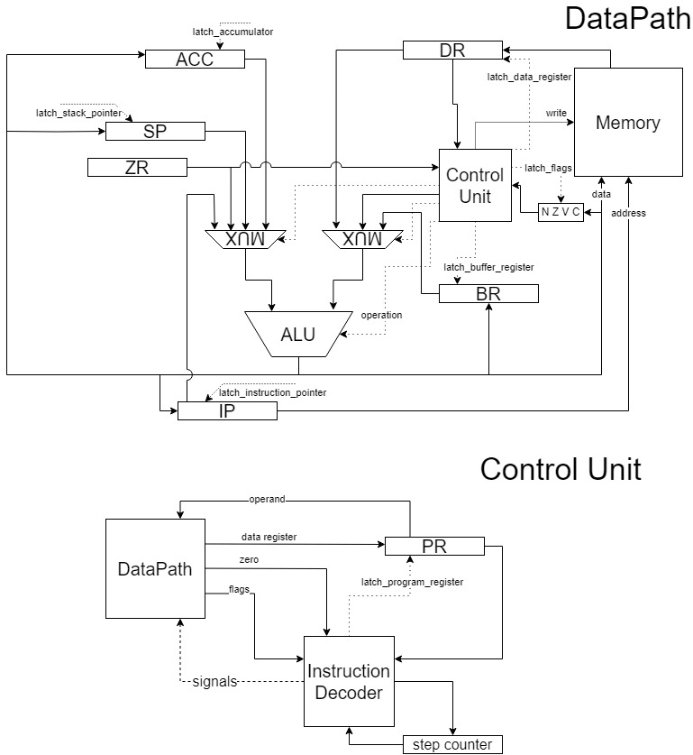
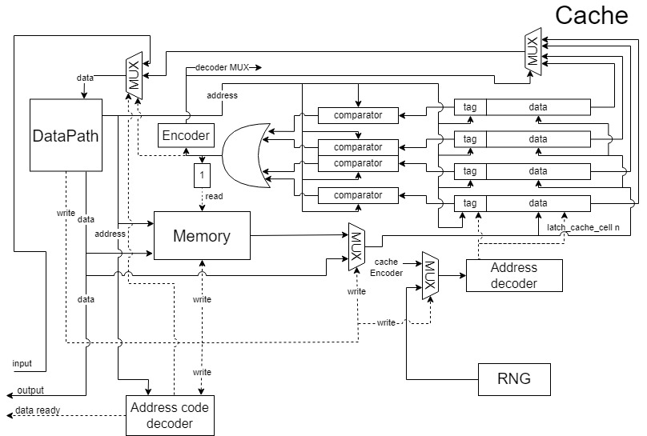

# Отчёт по лабораторной работе №3
Мартыненко Вадим Андреевич, P3232

```lisp -> asm | acc | neum | hw | tick -> instr | struct | stream | mem | pstr | prob1 | cache```

Вариант с усложнением + свой язык (TypeScript).

## Язык программирования Lisp
### Синтаксис
```ebnf
<program> ::= '(' <expression>+ ')'

<print> ::= '(print' <value> ')'
<print-char> ::= '(printc' <value> ')'
<set> ::= '(setq' <variable> <value> ')'
<read> ::= '(read' <variable> ')' 
<read-line> ::= '(read-line' <variable> ')' 

<function-call> ::= '('<letter>+ '(' <value>* ')' ')'
<function-definition> ::= '(function' <letter>+ '(' <variable>+ ')' <program> ')'

<while-loop> ::= '(while' <logical-expression> <expression> ')' | '(while' <logical-expression> <program> ')'

<comparasion> ::= '(if' <logical-expression> <atom> <atom> ')' | '(if' <logical-expression> <program> <program> ')'
<logical-expression> ::= <boolean> | <variable> | '(' <logical-operator> <value> <value> ')'
<logical-operator> ::= '>' | '<' | '=' | '!=' | '<=' | '>='

<value> ::= <expression> | <atom> | <logical-expression> | <comparasion>

<expression> ::= <while-loop> | <print> | <set> | <function-call> | <function-definition> | <read> | <read-line>

<atom> ::= <variable> | <number> | <string> | <boolean> | <char>

<arithmetic-expression> ::= '('<arithmetic-operator> <value> <value> ')'
<arithmetic-operator> ::= '+' | '-' | '*' | '/' | '%'

<variable> ::= <letter>+

<boolean> ::= 'true' | 'false'
<number> ::= <digit>+
<char> ::= "'"<character>"'"

<string> ::= '"'<character>*'"'
<character> ::= <letter> | <digit> | <special_character>
<digit> ::= "0" | "1" | "2" | "3" | "4" | "5" | "6" | "7" | "8" | "9"
<letter> ::= "a" | "b" | "c" | "d" | "e" | "f" | "g" | "h" | "i" | "j" | "k" | "l" | "m" | "n" | "o" | "p" | "q" | "r" | "s" | "t" | "u" | "v" | "w" | "x" | "y" | "z" | "A" | "B" | "C" | "D" | "E" | "F" | "G" | "H" | "I" | "J" | "K" | "L" | "M" | "N" | "O" | "P" | "Q" | "R" | "S" | "T" | "U" | "V" | "W" | "X" | "Y" | "Z"

<special_character> ::= "!" | "@" | "#" | "$" | "%" | "^" | "&" | "*" | "(" | ")" | "-" | "_" | "+" | "=" | "{" | "}" | "[" | "]" | "|" | "\" | ":" | ";" | "<" | ">" | "," | "." | "/" | "?" | "`" | "~"
```
### Семантика

Код выполняется последовательно.</br>
Операции:
+ `setq` - присвоить значение переменной.
+ `print` - вывести значение переменной (строка или число), либо константу (строку или число).
+ `printc` - вывести значение переменной как символ (не преобразовывать в ASCII).
+ `while` - циклически выполняет код, пока условие истинно, либо выражение не равно нулю.
+ `function` - объявление новой функции, есть поддержка рекурсии.
+ `if` - выполняет код в зависимости от результата сравнения.
+ `read` - выполняет чтение одного символа в указанную перменную, если указана строковая, то чтение в конец строки, иначе обычное присвоение.
+ `read-line` - выполняет чтение символов в переданную переменную, пока не встретиться перенос строки, перезаписывает существующую строку.

**Переменные:**
+ Имеют два типа - число (целое, знаковое) и строка.
+ Типы неявно определяются во время компиляции и не могут изменятся.
+ Объявленные вне функции имеют глобальную область видимости.
+ Объявленные в функции - функциональную.
+ Обращение к переменным и функциям до их объявления запрещено.
+ Переменная объявляется при первом присвоении значения - `setq`.

Любое выражение или вызов функции всегда возвращают последнее вычисленное выражение.</br>

Функция может быть повторно объявлена, при этом во время исполнения будет вызываться только самое последнее объявление.

`while` и `if` в качестве условия могут использовать как логические выражения, так и переменные, либо константы, в этом случае будет выполнятся сравнение с нулём.

Выполнение программы начинается с первого выражения, не считая объявления функций.

Имена переменных и функций чувствительны к регистру.

**Литералы:**
+ Бывают трёх типов: число, строка, символ.
+ Числовые преобразуются загружаются напрямую, в памяти не хранятся.
+ Символьные преобразуются в код символа и работают также как и числовые.
+ Строковые хранятся вместе со всеми строками, вместо них подставляется адрес.

## Организация памяти
+ фон Неймановская архитектура - общая память для инструкций и данных;
+ размер машшинного слова не определён (реализуется высокоуровневой структурой данных);
+ размер ячейки памяти - 32 бита;
+ инструкция и данные взаимо-конвертируемые.

**Виды адресации:**
+ `абсолютная` - обращение по указанному адресу;
+ `относительная` - смещение относительно `IP`;
+ `стековая` - смещение относительно `SP`;
+ `непрямая стековая` - значение на вершине стека воспринимается как адрес;
+ `аккумуляторная` - значение аккумулятора воспринимается как адрес.

Стек представлен `Stack Pointer` регистром, хранится в общей памяти.
### Модель памяти
```
   Registers
+------------------------------+
| ACC     IP     SP      PR    |
| DR      BR     ZR            |
+------------------------------+

  Instruction and data memory
+------------------------------+
| 00  : jmp N                  |
| 01  : stdout                 |
| 02  : stdin                  |
|    ...                       |
| 10  : variable x             |
| 11  : variable y             |
|    ...                       |
| n   : program start          |
|    ...                       |
|     : HALT                   |
| i   : function 0             |
| i+1 : function 1             |
|    ...                       |
| k   : string 0               |
| k+1 : string 1               |
|    ...                       |
+------------------------------+

```
В раздел переменных будут сохранены только локальные переменные, для чисел там будет содержаться значение, для строк - адрес начала.

В памяти сохраняются только строковые литералы, которые хранятся вместе со всеми строками. Вместо литералов подставляются их значения (для строк адрес).

Локальные переменные отображаются на стеке.
## ISA
| Язык  | Инструкция                          | Кол-во тактов | Описание                                                                        |
|:------|:------------------------------------|:--------------|:--------------------------------------------------------------------------------|
| NOP   | no operation                        | 2             | ничего не делать                                                                |
| ADD   | add `<address> &#124; <value>`      | 4-8           | прибавить к аккумулятору значение по адресу или значение записанное вместо него |
| SUB   | subtract `<address> &#124; <value>` | 4-8           | вычесть значение из аккумулятора                                                |
| MUL   | multiply `<address> &#124; <value>` | 4-8           | умножить значение в аккумуляторе                                                |
| DIV   | divide `<address> &#124; <value>`   | 4-8           | разделить значение в аккумуляторе                                               |
| MOD   | modulo `<address> &#124; <value>`   | 4-8           | найти остаток от деления аккумулятора на значение                               |
| GT    | greater than `<count>`              | 3             | переход, если больше (Z == 0 & N == 0)                                          |
| LT    | less than `<count>`                 | 3             | переход, если меньше (N == 1)                                                   |
| GE    | greater or equal `<count>`          | 3             | переход, если больше или равно (N == 0 &#124; Z == 1)                           |
| LE    | less or equal `<count>`             | 3             | переход, если меньше или равно (Z == 1 &#124; N == 1)                           |
| JMP   | jump `<count>`                      | 3             | перейти к указанной инструкции                                                  |
| JZ    | jump if zero `<count>`              | 3             | переход, если ноль (Z == 1)                                                     |
| JNZ   | jump if not zero `<count>`          | 3             | переход, если не ноль (Z == 0)                                                  |
| CALL  | call `<address>`                    | 7             | вызвать функцию                                                                 |
| RET   | return                              | 6             | вернуться из функции                                                            |
| INC   | increment                           | 3             | увеличить значение аккумулятора на 1                                            |
| DEC   | decrement                           | 3             | уменьшить значение аккумулятора на 1                                            |
| CMP   | compare `<address> &#124; <value>`  | 4-8           | выставить флаги по результату вычитания из аккумулятора значения                |
| HALT  | halt                                | 2             | завершить выполнение программы                                                  |
| LD    | load `<address> &#124; <value>`     | 4-8           | загрузить значение в аккумулятор                                                |
| ST    | store `<address>`                   | 6             | сохранить значение в память                                                     |
| PUSH  | push                                | 7             | поместить значение в стек                                                       |
| POP   | pop                                 | 9             | извлечь значение из стека                                                       |
| FLUSH | flush                               | 3             | увеличить указатель стека без загрузки данных                                   |
| SWAP  | swap                                | 13            | поменять местами значение в аккумуляторе и значением на вершине стека           |

### Формат инструкций

Инструкции представлены в формате JSON:
```json
{
    "line": 0,
    "source": "char[40]",
    "opcode": 23,
    "arg": 69
}
```
```json
{
    "line": 0,
    "source": "(setq y char[40])",
    "opcode": 24,
    "arg": {
        "addressing": 2,
        "value": 4
    }
}
```
Поля инструкций:
+ `source` - исходный код, из которого были сгенерированы инструкции.
+ `opcode` - код инструкции.
+ `arg` - агрумент команды, число, либо адрес, если команда не предусматривает его использование, то игнорируется.

## Транслятор

Интерфейс командной строки: </br>
`node translator.js <input file> <output file>` </br>
[translator.ts](./translator.ts)

**Трансляция происходит в два этапа:**
+ создание последовательности инструкций;
+ пост-обработка.

На **первом этапе** код рекурсивно разбивается на выражения, пока не доходит до простейших выражения. После чего начинается создание инструкций на выходе из рекурсий. Для временного хранения значений используется стек, например при сравнении или арифметике. Значение выражения всегда остаётся в аккумудяторе, так его можно сразу использовать или сохранить.</br>
Переменные и функции сохраняются в лексическом окружении, при обращении происходит проверка их наличия там. Для каждой функции создаётся своё лексическое окружение, у которого родитель - глобальное. Это нужно для доступа к глобальным переменным ~~(в перспективе для замыканий)~~.

На **втором этапе** происходит выделение памяти для переменных и строк. Код функций добавляется в конец кода программы, а после них выделяется память для строк.</br>
Заглушки в аргументах инструкций с чтение/записью переменных, вызовом функций заменяются их адресами.


## Процессор

Интерфейс командной строки: </br>
`node processor.js <program_code_file> <stdin_file> <stdout_file> <time_limit>` </br>
[processor.ts](./model/processor.ts)



### DataPath

**Сигналы** (обрабатываются за один такт, реализованы в виде методов класса):

+ `latch_data_register` -- защёлкнуть в `DR` выход памяти данных;
+ `latch_memory` -- записать значение аккумулятора в память;
+ `latch_instruction_pointer` -- защёлкнуть в `IP` выход АЛУ;
+ `latch_accumulator` -- защёлкнуть в `ACC` выход АЛУ;
+ `latch_stack_pointer` -- защёлкнуть в `SP` выход АЛУ;
+ `latch_buffer_register` -- защёлкнуть в `BR` выход АЛУ.

Чтение и запись в память производится по адресу в `IP`.

### Control Unit

Hardwired (реализовано полностью на TypeScript). </br>
Метод `start_simulation` моделирует выполнение полного цикла программы.

**Сигналы:**
+ `latch_program_register`

**Особенности работы модели:**

+ Цикл симуляции осуществляется в функции `start_simulation`.
+ Шаг моделирования соответствует одной инструкции с выводом состояния в журнал.
+ Для журнала состояний процессора используется класс `Logger`.
+ Количество инструкций для моделирования лимитировано.
+ Остановка моделирования осуществляется при:
  + превышении лимита количества выполняемых инструкций;
  + если нет данных для чтения из порта ввода;
  + выполнении инструкция halt (состояние процессора `Halted`).

**Флаги:**

+ `Negative` - отражает наличие отрицательного значения на выходе АЛУ;
+ `Zero` - отражает наличие нулевого значения на выходе АЛУ;

+ `Overflow` и `Carry` - переполнение при операциях знаковой и беззнаковой арифметики соотвественно, не используются ~~(играл в двоичную арифметику и проиграл)~~.

Флаги выставляются только при арифметических действиях с аккумулятороом (`ADD`, `SUB`, `MOD`...), а также при выполнении инструкции `CMP`. При загрузке данных из памяти флаги не изменяются (в т.ч. `Zero`).

## Тестирование

[golden.test.ts](./golden.test.ts) </br>
GitHub Actions: [node.js.yml](./.github/workflows/node.js.yml)

Где:
+ `eslint` - линтер с поддержкой типов TS;
+ `npm test` - запуск цели `test` в `package.json`, для тестирование использовалась утилита `jest`.


**Пример использования и журнал работы процессора на примере `hello`: [link](./hello_run.txt)**


**Пример запуска тестов:**
```
PS C:\Users\RAZRULETEL\WebstormProjects\processor> npm test

> processor@1.0.0 test
> jest

 PASS  ./golden.test.js
 PASS  ./golden.test.ts

Test Suites: 2 passed, 2 total
Tests:       10 passed, 10 total
Snapshots:   0 total
Time:        4.656 s, estimated 9 s
Ran all test suites.
```

*Статистика без кэша (обращение к памяти - 1 такт).*
```
| ФИО                        | алг   | LoC | code байт | code инстр. | инстр. | такт.  | вариант                                                                                      |
| Мартыненко Вадим Андреевич | hello | 3   | -         | 15          | 127    | 808    | lisp -> asm | acc | neum | hw | tick -> instr | struct | stream | mem | pstr | prob1 | cache |
| Мартыненко Вадим Андреевич | cat   | 6   | -         | 10          | 2027   | 12157  | lisp -> asm | acc | neum | hw | tick -> instr | struct | stream | mem | pstr | prob1 | cache |
| Мартыненко Вадим Андреевич | prob1 | 15  | -         | 504         | 32972  | 208172 | lisp -> asm | acc | neum | hw | tick -> instr | struct | stream | mem | pstr | prob1 | cache |
```

## Кэш

+ полностью ассоциативный 
+ 4 линии
+ политика вытеснения: random
+ политика записи: write-through

[memory-cache.ts](./model/memory-cache.ts)



**Показатели работы кэша на алгоритме `cat`, размер ввода 3630 символов:**

| Кол-во линий | Кол-во тактов |
|:-------------|:--------------|
| 0-1          | 446 555       |
| 2            | 444 620       |
| 3            | 430 067       |
| 4            | 399 935       |
| 5            | 359 867       |
| 6            | 308 855       |
| 7            | 251 336       |
| 8            | 185 303       |
| 9-∞          | 185 294       |

*Из-за политики вытеснения кол-во тактов может незначительно меняться между запусками, при том же количестве линий кэша.*

*Основной цикл программы состоит из 8 инструкций.*


*Статистика с 4 линиями кэша, чтение из кэша - 1 такт, из памяти 10 - тактов.*
```
| ФИО                        | алг   | LoC | code байт | code инстр. | инстр. | такт.  | вариант                                                                                      |
| Мартыненко Вадим Андреевич | hello | 3   | -         | 15          | 127    | 2284   | lisp -> asm | acc | neum | hw | tick -> instr | struct | stream | mem | pstr | prob1 | cache |
| Мартыненко Вадим Андреевич | cat   | 6   | -         | 10          | 2027   | 31949  | lisp -> asm | acc | neum | hw | tick -> instr | struct | stream | mem | pstr | prob1 | cache |
| Мартыненко Вадим Андреевич | prob1 | 15  | -         | 504         | 32972  | 592472 | lisp -> asm | acc | neum | hw | tick -> instr | struct | stream | mem | pstr | prob1 | cache |
```